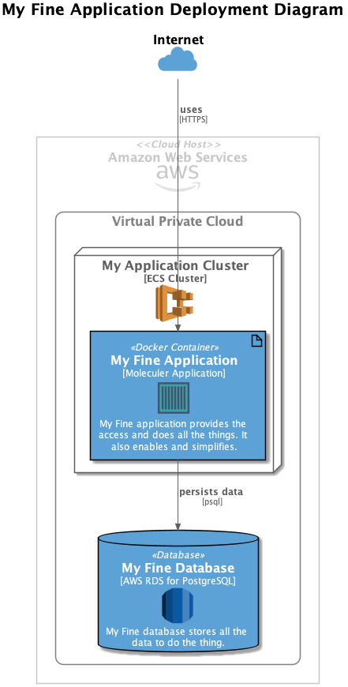

# Infrastructure-In-a-Box

The Infrastructure In a Box tool is a simple tool to help projects quickly bootstrap a Cloud Infrastructure for basic applications. 

Using a simple setup script, a user on a new project can generate a set
of Terraform files that describe standard components for a basic application. 

### Cloud Implementations

At the moment, only AWS is supported. We intend to generalize this to support Azure and Google Cloud Platform as well.

### What is a Basic Application?

At the high livel, we imagine that a basic application is deployed as
a Docker image that talks to a database. It might also talk to various external systems, but other than networking (and maybe secrets management), the external communications do not require AWS component set up. 

The following diagram shows what we are getting at the end:

## Getting Started

Before you can use this tool, there are some prerequisties:

1. You must have set up an AWS account; and
2. You must have installed the AWS CLI tool, and configured the necessary .aws/credentials files

Once those prerequisites are out of the way, you should be able to create the inital set-up for your project by executing the following:

    ./setup.sh

